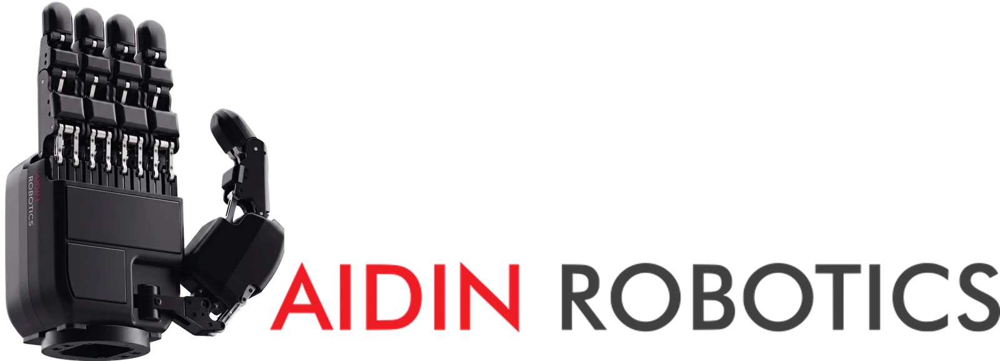
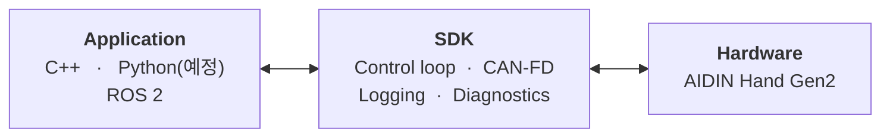

<div align="center">



<h1>AIDIN Hand Gen2 SDK</h1>

촉각 센서가 통합된 로봇 핸드 AIDIN Hand Gen2용 SDK입니다. C++와 Python API를 제공합니다.

[](CHANGELOG.md) [](https://github.com/aidinrobotics/aidin-hand2-sdk/actions/workflows/ci.yml)

[Build](#build-from-source) | [Documentation](#documentation) | [Changelog](CHANGELOG.md) | [Official Site](https://www.aidinrobotics.co.kr/) | [English](README.md) | 한국어

</div>

## Architecture



lifecycle과 명령·상태 API는 [C++ guide](docs/ko/07_cpp_usage_guide.md)를 참고하십시오.

## System Requirements

아래는 SDK 빌드·실행이 검증된 구성입니다.

| Component | Requirement |
|---|---|
| Operating System | Ubuntu 22.04 / 24.04 |
| Compiler | GCC ≥ 11 |
| Build system | CMake ≥ 3.16 |
| CAN device | [SocketCAN](https://docs.kernel.org/networking/can.html)이 지원되는 CAN FD capable device |
| CAN bitrate | arbitration 1 Mbit/s / data 5 Mbit/s |
| Dependencies | spdlog ≥ 1.9, can-utils |
| Python bindings (예정) | Python ≥ 3.10, numpy |
| ROS 2 wrapper (선택) | Humble |

500 Hz 실시간 제어에는 PREEMPT_RT kernel을 권장합니다. 커스텀·RT 패치 kernel(예: Jetson)은 CAN driver가 빠져 있을 수 있어 직접 켜야 합니다.

셋업 절차는 [Real-time kernel setup](docs/ko/04_real_time_kernel_setup.md)과 [CAN-FD setup](docs/ko/05_can_fd_setup.md)을 참고하십시오.

## Testing

빌드·unit test(하드웨어 비의존). GitHub Actions가 `main`으로의 push와 pull request마다 GitHub 제공 Ubuntu 22.04·24.04 runner에서 x86_64와 arm64 양쪽으로 실행하고, unit test를 ThreadSanitizer로 한 번 더 실행합니다. 위 배지가 최근 결과를 나타냅니다.

| Platform | build + unit tests |
|---|---|
| x86_64 · Ubuntu 22.04 | ✅ |
| x86_64 · Ubuntu 24.04 | ✅ |
| arm64 · Ubuntu 22.04 | ✅ |
| arm64 · Ubuntu 24.04 | ✅ |

표가 담는 것은 빌드와 unit test뿐입니다. CAN-FD, PREEMPT_RT, 500 Hz는 커널 쪽이므로 실기에서
검증합니다.

## Build from source

Install dependencies:

```bash
sudo apt update
sudo apt install -y build-essential cmake libspdlog-dev can-utils
```

Build and test:

```bash
cmake -S cpp -B cpp/build -DCMAKE_BUILD_TYPE=RelWithDebInfo
cmake --build cpp/build -j"$(nproc)"
ctest --test-dir cpp/build --output-on-failure
```

Install:

```bash
sudo cmake --install cpp/build
sudo ldconfig
```

## Documentation

### Hardware

- [Specification](docs/ko/01_specification.md) — actuator / joint / tactile 배치와 index (예정)
- Mechanical — 치수, 무게, 마운팅 (예정)
- Electrical — 전원, 커넥터, CAN 결선 (예정)

### Getting started

- [Real-time kernel setup](docs/ko/04_real_time_kernel_setup.md) — PREEMPT_RT kernel과 real-time settings
- [CAN-FD setup](docs/ko/05_can_fd_setup.md) — driver 확인과 CAN-FD interface bring-up
- [SDK build & install](docs/ko/06_sdk_build_and_install.md) — 빌드·테스트·설치와 예제

### C++ guide

- [Usage guide](docs/ko/07_cpp_usage_guide.md) — 생성, 운전, homing, command, 관측
- [API reference](docs/ko/08_cpp_api_reference.md) — 헤더별 심볼과 필드·단위·계약
- [Logging](docs/ko/09_cpp_logging.md) — log sink, callback, record 해석

### Python guide

- Usage guide — lifecycle, 소유권, command mode (예정)
- API reference — type·unit·state·diagnostics 계약 (예정)
- Logging — log sink, callback, diagnostics (예정)

### Operations

- [Workspace limits](docs/ko/14_workspace_limits.md) — 명령이 clamp 되는 범위
- [Error messages](docs/ko/15_error_messages.md) — 오류 문구별 원인과 조치

## Related repositories

- [aidin-hand2-ros2](https://github.com/aidinrobotics/aidin-hand2-ros2) — ROS 2 wrapper
- Web GUI (예정) — 브라우저 GUI와 WebSocket bridge

## License

AIDIN Hand Gen2 SDK는 [Apache License 2.0](LICENSE)으로 배포됩니다. 라이센스가 하위 배포자에게 유지하도록 요구하는 고지 사항은 [NOTICE](NOTICE) 파일에 있습니다.

SDK는 서드파티 소프트웨어를 포함하고 링크합니다. 구성 요소별 라이센스와 소스 입수 경로는 [THIRD_PARTY_NOTICES.md](THIRD_PARTY_NOTICES.md)에 정리했고, 라이센스 전문은 [licenses/](licenses) 디렉터리에 두었습니다.

`cpp/prebuilt/<arch>/libaidin_hand2_kinematics.so.1` 파일에도 repo의 나머지와 동일하게 Apache License 2.0이 적용됩니다. kinematics 방정식과 핸드 기하 상수를 공개하지 않기 때문에 바이너리로 배포하며, Apache License 2.0은 object 형태의 배포를 허용합니다.
