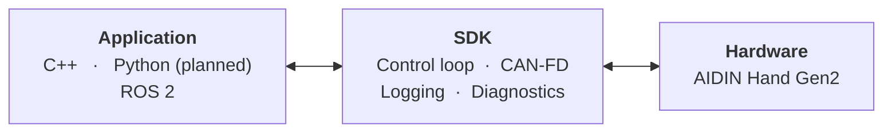

<div align="center">

<a href="https://www.aidinrobotics.co.kr/"></a>

<h1>AIDIN Hand Gen2 SDK</h1>

The SDK for the AIDIN Hand Gen2, a robot hand with integrated tactile sensors. It provides C++ and Python APIs.

[](CHANGELOG.md) [](https://github.com/aidinrobotics/aidin-hand2-sdk/actions/workflows/ci.yml) [](LICENSE)

[Build](#build-from-source) | [Documentation](#documentation) | [Changelog](CHANGELOG.md) | [Official Site](https://www.aidinrobotics.co.kr/) | English | [한국어](README.ko.md)

</div>

## Architecture



For the lifecycle and the command/state API, see the [C++ guide](docs/en/07_cpp_usage_guide.md).

## System Requirements

The configuration below is verified for building and running the SDK.

| Component | Requirement |
|---|---|
| Operating System | Ubuntu 22.04 / 24.04 |
| Compiler | GCC ≥ 11 |
| Build system | CMake ≥ 3.16 |
| CAN device | CAN FD capable device supported by [SocketCAN](https://docs.kernel.org/networking/can.html) |
| CAN bitrate | 1 Mbit/s arbitration / 5 Mbit/s data |
| Dependencies | spdlog ≥ 1.9, can-utils |
| Python bindings (planned) | Python ≥ 3.10, numpy |
| ROS 2 wrapper (optional) | Humble |

A PREEMPT_RT kernel is recommended for 500 Hz real-time control. Custom or RT-patched kernels (e.g. Jetson) may ship without the CAN driver — enable it yourself.

See [Real-time kernel setup](docs/en/04_real_time_kernel_setup.md) and [CAN-FD setup](docs/en/05_can_fd_setup.md) for setup steps.

## Testing

Build and unit tests (hardware-independent). GitHub Actions runs them on every push and pull request against `main`, on the GitHub-hosted Ubuntu 22.04 and 24.04 runners for both x86_64 and arm64, and runs the unit tests again under ThreadSanitizer. The badge above reports the latest result.

| Platform | build + unit tests |
|---|---|
| x86_64 · Ubuntu 22.04 | ✅ |
| x86_64 · Ubuntu 24.04 | ✅ |
| arm64 · Ubuntu 22.04 | ✅ |
| arm64 · Ubuntu 24.04 | ✅ |

The table covers the build and the unit tests only. CAN-FD, PREEMPT_RT and the 500 Hz loop are
kernel-side and are verified on the device.

## Build from source

Install dependencies:

```bash
sudo apt update
sudo apt install -y build-essential cmake libspdlog-dev can-utils
```

Build and test:

```bash
cmake -S cpp -B cpp/build -DCMAKE_BUILD_TYPE=RelWithDebInfo
cmake --build cpp/build -j"$(nproc)"
ctest --test-dir cpp/build --output-on-failure
```

Install:

```bash
sudo cmake --install cpp/build
sudo ldconfig
```

## Documentation

### Hardware

- [Specification](docs/en/01_specification.md) — actuator / joint / tactile layout and indices (planned)
- Mechanical — dimensions, weight, and mounting (planned)
- Electrical — power, connectors, and CAN wiring (planned)

### Getting started

- [Real-time kernel setup](docs/en/04_real_time_kernel_setup.md) — PREEMPT_RT kernel and real-time settings
- [CAN-FD setup](docs/en/05_can_fd_setup.md) — driver check and CAN-FD interface bring-up
- [SDK build & install](docs/en/06_sdk_build_and_install.md) — build, test, install, and verify with the example

### C++ guide

- [Usage guide](docs/en/07_cpp_usage_guide.md) — creation, operation, homing, commands, observation
- [API reference](docs/en/08_cpp_api_reference.md) — per-header symbols with field, unit, and contract
- [Logging](docs/en/09_cpp_logging.md) — log sinks, callbacks, and reading a record

### Python guide

- [Usage guide](docs/en/10_python_usage_guide.md) — lifecycle, ownership, and command modes (planned)
- [API reference](docs/en/11_python_api_reference.md) — type, unit, state, and diagnostics contracts (planned)
- [Logging](docs/en/12_python_logging.md) — log sinks, callbacks, and diagnostics (planned)

### Operations

- [Workspace limits](docs/en/14_workspace_limits.md) — the range commands are clamped to
- [Error messages](docs/en/15_error_messages.md) — the cause and remedy for each message

## Related repositories

- [aidin-hand2-ros2](https://github.com/aidinrobotics/aidin-hand2-ros2) — ROS 2 wrapper
- Web GUI (pending) — browser GUI and WebSocket bridge

## License

The AIDIN Hand Gen2 SDK is licensed under the [Apache License 2.0](LICENSE). [NOTICE](NOTICE) holds the attribution notice that the license requires a downstream distribution to carry.

The SDK also includes and links third-party software. [THIRD_PARTY_NOTICES.md](THIRD_PARTY_NOTICES.md) lists each component with its license and where its source can be obtained, and [licenses/](licenses) holds the full license texts.

`cpp/prebuilt/<arch>/libaidin_hand2_kinematics.so.<version>` is covered by the same Apache License 2.0 as the rest of the repository. It ships as a binary because the kinematics equations and the hand geometry constants are not published, and the license permits distribution in object form.
