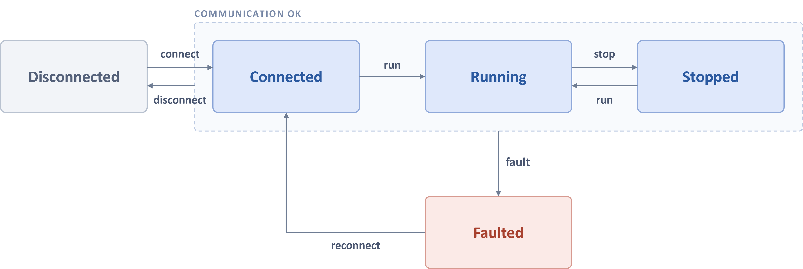

# C++ guide

The AIDIN Hand Gen2 is a robot hand that moves 21 joints (16 active and 5 passive) with 16 actuators
across five fingers, and it carries tactile sensors on the fingertips, the finger segments, and the
palm. This document explains how you connect the SDK to a user application and control the robot
hand.
</br>It starts with the types and the configuration, then covers state transitions, homing,
commands, controller settings, limits, observation, and error handling in that order. Complete
[SDK build & install](06_sdk_build_and_install.md) first.

Every symbol lives in the `aidin_hand2` namespace, and the code in this document uses `ah2` as an
alias. For the list of symbols and fields, see the [API reference](08_cpp_api_reference.md).

Each chapter ends with the examples that run what the chapter describes. The examples are in
[`cpp/examples/`](../../cpp/examples) and the SDK build produces them, so run the executable of the
same name under `cpp/build/`. Each takes two arguments, the side and the interface, and the defaults
are `right` and `can0`.

```bash
./cpp/build/04_homing left can0      # [right|left] [interface]
```

Every example prints its results to the terminal, and on `Ctrl-C` it leaves the loop it is running,
confirms the quick stop, and disconnects before it exits. The first comment of each file states what
the example demonstrates and whether the robot hand moves, so read it before you run it.

## Contents

&nbsp;&nbsp;[**1. HandManager and Hand**](#1-handmanager-and-hand)<br>
&nbsp;&nbsp;&nbsp;&nbsp;&nbsp;&nbsp;[1.1 Types](#11-types)<br>
&nbsp;&nbsp;&nbsp;&nbsp;&nbsp;&nbsp;[1.2 HandConfig](#12-handconfig)<br>
&nbsp;&nbsp;&nbsp;&nbsp;&nbsp;&nbsp;[1.3 Create and destroy](#13-create-and-destroy)<br>
&nbsp;&nbsp;[**2. Lifecycle**](#2-lifecycle)<br>
&nbsp;&nbsp;&nbsp;&nbsp;&nbsp;&nbsp;[2.1 Lifecycle states](#21-lifecycle-states)<br>
&nbsp;&nbsp;&nbsp;&nbsp;&nbsp;&nbsp;[2.2 State transition calls](#22-state-transition-calls)<br>
&nbsp;&nbsp;&nbsp;&nbsp;&nbsp;&nbsp;[2.3 Transition confirmation](#23-transition-confirmation)<br>
&nbsp;&nbsp;&nbsp;&nbsp;&nbsp;&nbsp;&nbsp;&nbsp;&nbsp;&nbsp;[2.3.1 Confirmation criteria](#231-confirmation-criteria)<br>
&nbsp;&nbsp;&nbsp;&nbsp;&nbsp;&nbsp;&nbsp;&nbsp;&nbsp;&nbsp;[2.3.2 Confirmation failure](#232-confirmation-failure)<br>
&nbsp;&nbsp;[**3. Homing**](#3-homing)<br>
&nbsp;&nbsp;[**4. Control settings**](#4-control-settings)<br>
&nbsp;&nbsp;&nbsp;&nbsp;&nbsp;&nbsp;[4.1 Max effort](#41-max-effort)<br>
&nbsp;&nbsp;&nbsp;&nbsp;&nbsp;&nbsp;[4.2 Controllers](#42-controllers)<br>
&nbsp;&nbsp;&nbsp;&nbsp;&nbsp;&nbsp;&nbsp;&nbsp;&nbsp;&nbsp;[4.2.1 Joint position controller](#421-joint-position-controller)<br>
&nbsp;&nbsp;&nbsp;&nbsp;&nbsp;&nbsp;&nbsp;&nbsp;&nbsp;&nbsp;[4.2.2 Joint impedance controller](#422-joint-impedance-controller)<br>
&nbsp;&nbsp;[**5. Command**](#5-command)<br>
&nbsp;&nbsp;&nbsp;&nbsp;&nbsp;&nbsp;[5.1 Command types](#51-command-types)<br>
&nbsp;&nbsp;&nbsp;&nbsp;&nbsp;&nbsp;[5.2 Validation and clamp](#52-validation-and-clamp)<br>
&nbsp;&nbsp;&nbsp;&nbsp;&nbsp;&nbsp;&nbsp;&nbsp;&nbsp;&nbsp;[5.2.1 Rejected by state](#521-rejected-by-state)<br>
&nbsp;&nbsp;&nbsp;&nbsp;&nbsp;&nbsp;&nbsp;&nbsp;&nbsp;&nbsp;[5.2.2 Rejected by value](#522-rejected-by-value)<br>
&nbsp;&nbsp;&nbsp;&nbsp;&nbsp;&nbsp;&nbsp;&nbsp;&nbsp;&nbsp;[5.2.3 Workspace clamp](#523-workspace-clamp)<br>
&nbsp;&nbsp;&nbsp;&nbsp;&nbsp;&nbsp;[5.3 Command lifetime](#53-command-lifetime)<br>
&nbsp;&nbsp;[**6. Kinematics**](#6-kinematics)<br>
&nbsp;&nbsp;&nbsp;&nbsp;&nbsp;&nbsp;[6.1 Conversion functions](#61-conversion-functions)<br>
&nbsp;&nbsp;&nbsp;&nbsp;&nbsp;&nbsp;[6.2 Active and passive joints](#62-active-and-passive-joints)<br>
&nbsp;&nbsp;[**7. HandState**](#7-handstate)<br>
&nbsp;&nbsp;&nbsp;&nbsp;&nbsp;&nbsp;[7.1 Actuators and joints](#71-actuators-and-joints)<br>
&nbsp;&nbsp;&nbsp;&nbsp;&nbsp;&nbsp;[7.2 Applied command](#72-applied-command)<br>
&nbsp;&nbsp;&nbsp;&nbsp;&nbsp;&nbsp;[7.3 Tactile](#73-tactile)<br>
&nbsp;&nbsp;[**8. Diagnostics**](#8-diagnostics)<br>
&nbsp;&nbsp;&nbsp;&nbsp;&nbsp;&nbsp;[8.1 Actuator faults](#81-actuator-faults)<br>
&nbsp;&nbsp;&nbsp;&nbsp;&nbsp;&nbsp;[8.2 Diagnostic record](#82-diagnostic-record)<br>
&nbsp;&nbsp;[**9. Error handling**](#9-error-handling)<br>
&nbsp;&nbsp;&nbsp;&nbsp;&nbsp;&nbsp;[9.1 Exception](#91-exception)<br>
&nbsp;&nbsp;&nbsp;&nbsp;&nbsp;&nbsp;[9.2 Detecting a failure](#92-detecting-a-failure)<br>
&nbsp;&nbsp;&nbsp;&nbsp;&nbsp;&nbsp;[9.3 Recovery patterns](#93-recovery-patterns)<br>
&nbsp;&nbsp;&nbsp;&nbsp;&nbsp;&nbsp;&nbsp;&nbsp;&nbsp;&nbsp;[9.3.1 Self-managed lifecycle](#931-self-managed-lifecycle)<br>
&nbsp;&nbsp;&nbsp;&nbsp;&nbsp;&nbsp;&nbsp;&nbsp;&nbsp;&nbsp;[9.3.2 Externally managed lifecycle](#932-externally-managed-lifecycle)<br>
&nbsp;&nbsp;&nbsp;&nbsp;&nbsp;&nbsp;&nbsp;&nbsp;&nbsp;&nbsp;[9.3.3 Exit on failure](#933-exit-on-failure)<br>
&nbsp;&nbsp;&nbsp;&nbsp;&nbsp;&nbsp;[9.4 Recovering from Faulted](#94-recovering-from-faulted)<br>
&nbsp;&nbsp;&nbsp;&nbsp;&nbsp;&nbsp;&nbsp;&nbsp;&nbsp;&nbsp;[9.4.1 Manual recovery](#941-manual-recovery)<br>
&nbsp;&nbsp;&nbsp;&nbsp;&nbsp;&nbsp;&nbsp;&nbsp;&nbsp;&nbsp;[9.4.2 Automatic recovery](#942-automatic-recovery)

## 1. HandManager and Hand

### 1.1 Types

The SDK reaches the AIDIN Hand Gen2 through [`HandManager`](08_cpp_api_reference/hand_manager.md#handmanager) and [`Hand`](08_cpp_api_reference/hand.md#hand).

| Type | Description |
|---|---|
| `HandManager` | The factory that validates a `HandConfig` and that creates and destroys a `HandCore`. It returns a `Hand` |
| `Hand` | A handle that references one `HandCore`. It connects, controls, configures, and queries |

`HandCore` is an internal class that controls the AIDIN Hand Gen2 over CAN-FD. The public headers
do not define it, so you cannot create or reference it directly. `HandManager` owns it, and
`destroy()` destroys it.

### 1.2 HandConfig

[`HandConfig`](08_cpp_api_reference/types_config.md#handconfig) configures how a `Hand` behaves. The `interface_name` and `hand_side` fields are
constructor arguments, and the remaining fields have defaults.

The following example builds a config with every field written out.

```cpp
// These values are an example, not the defaults. The table below lists the defaults.
ah2::HandConfig config{"can0", ah2::HandSide::Left};   // the 2 constructor arguments are required
config.control_rate              = 500;                // Hz
config.auto_home                 = false;
config.rt_cpu_affinity           = -1;
config.auto_reconnect            = true;
config.auto_reconnect_timeout_ms = 5000;               // ms
config.auto_reconnect_home       = true;
config.disabled_actuators        = {};                 // for example, {3, 7}
```

| Field | Type | Default | Description |
|---|---|---|---|
| `interface_name` | `std::string` | required | The name of the CAN interface |
| `hand_side` | [`HandSide`](08_cpp_api_reference/types_description.md#enum-handside) | required | Which side the robot hand is, left or right |
| `control_rate` | `int` | `500` | The control rate [Hz] |
| `auto_home` | `bool` | `true` | Whether [`run()`](08_cpp_api_reference/hand.md#handrun) also homes.</br> It homes only when the `homing_state` value is not `Succeeded` |
| `rt_cpu_affinity` | `int` | `-1` | The CPU that the SDK pins the thread of the control and communication loop to.</br> `-1` pins nothing.|
| `auto_reconnect` | `bool` | `false` | Whether the SDK reconnects on its own after a communication error |
| `auto_reconnect_timeout_ms` | `int` | `0` | The time limit for automatic reconnection [ms]. </br>`0` sets no limit. The SDK ignores this field when `auto_reconnect=false` |
| `auto_reconnect_home` | `bool` | `false` | Whether automatic reconnection also homes. </br> It does not apply to a manual [`reconnect()`](08_cpp_api_reference/hand.md#handreconnect) |
| `disabled_actuators` | `std::vector<int>` | `{}` | The [actuator index](08_cpp_api_reference/types_description.md#array-conventions) values that the SDK leaves out of operation |

The constructor and `create()` reject the following two cases.

- If the `interface_name` field is empty, or if the `hand_side` field holds a value that the enum
  does not define, the constructor throws an exception.
- If the `control_rate` value is `0` or less, `create()` throws `InvalidArgument`.

The `disabled_actuators` field names the actuators that the SDK leaves unpowered. Use it when you
run the robot hand while excluding an actuator that is physically absent, or one that you do not
use for now because it has failed. List the actuators **by finger** whenever you can.

### 1.3 Create and destroy

[`create()`](08_cpp_api_reference/hand_manager.md#handmanagercreate) validates the config, creates a `HandCore`, and returns a `Hand` that references that
`HandCore`. [`connect()`](08_cpp_api_reference/hand.md#handconnect) opens the CAN connection.

```cpp
ah2::HandManager manager;
ah2::Hand hand = manager.create(config);
```

A copy of a `Hand` references the same `HandCore`. The copy adds one handle, and it does not add a
`HandCore`.

```cpp
ah2::Hand copy = hand;       // references the same hand
manager.destroy(hand);       // copy becomes invalid as well
```

- After a [`destroy()`](08_cpp_api_reference/hand_manager.md#handmanagerdestroy) or [`destroy_all()`](08_cpp_api_reference/hand_manager.md#handmanagerdestroy_all) call, or after the manager goes out of scope, every `Hand`
  that referenced the destroyed `HandCore` becomes invalid, and any method call on it throws an
  exception.
- If the hand is connected, `destroy()` confirms the actuator quick stop, closes the connection, and
  then destroys the `HandCore`, so you can omit the [`disconnect()`](08_cpp_api_reference/hand.md#handdisconnect) call before it.
- `Hand` is not thread-safe. If several threads call the same `Hand`, the application owns the
  synchronization.

One `HandManager` can own several `HandCore` instances. To use two robot hands together, call
`create()` twice with configs that differ in the `interface_name` and `hand_side` fields. Each hand
has its own `HandCore` and its own control and communication loop, so the two run independently.
`destroy_all()` and the destruction of the manager destroy every `HandCore` that the manager owns.

> [!TIP]
> The following examples run what this chapter describes.
>
> - [`01_create_and_destroy.cpp`](../../cpp/examples/01_create_and_destroy.cpp) — `HandManager` owns
>   the resources, a copied `Hand` refers to the same resources, and after `destroy()` even the copy
>   throws. It runs without a robot hand.
> - [`02_two_hands.cpp`](../../cpp/examples/02_two_hands.cpp) — creates two robot hands under one
>   `HandManager` and prints the cycles of each, which advance independently of one another.

## 2. Lifecycle

### 2.1 Lifecycle states

The lifecycle of a [`Hand`](08_cpp_api_reference/hand.md#hand) is one of the following 5 states that the [`HandLifecycle`](08_cpp_api_reference/types_state.md#enum-handlifecycle) enum defines.
Read the current lifecycle with `get_diagnostics()`.</br></br>
</br></br>

| State | Description |
|---|---|
| `Disconnected` | The CAN socket is not open. The hand is in this state right after `create()` and after `disconnect()` completes. |
| `Connected` | The CAN socket is open and the SDK receives state, but it does not send control commands. |
| `Running` | The SDK has confirmed the actuator enable and sends control commands. `set_command()` works only in `Running`. |
| `Stopped` | The SDK has confirmed the actuator quick stop, and the actuators hold no torque. |
| `Faulted` | A communication error or an exception in the control and communication loop has ended communication and control. Only `reconnect()` moves the hand out of this state. |


### 2.2 State transition calls

You can call a state transition function from the lifecycle that the precondition column names
below. A call from a state that the table does not allow raises `WrongCallOrder`. For the wording
of each message, see [Error messages](15_error_messages.md#4-wrongcallorder).

None of these functions return as soon as they send the request. Each one waits until it confirms
the condition in the confirmation column, and it throws an exception when it cannot confirm the
condition within the time limit.

| Method | Precondition | Postcondition | Confirmation | Timeout |
|---|---|---|---|---|
| [`connect()`](08_cpp_api_reference/hand.md#handconnect) | `Disconnected` | `Connected` | The first state arrives | 300 ms |
| [`disconnect()`](08_cpp_api_reference/hand.md#handdisconnect) | `Connected` · `Running` · `Stopped` | `Disconnected` | Actuator quick stop | 500 ms |
| [`run()`](08_cpp_api_reference/hand.md#handrun) | `Connected` · `Stopped` | `Running` | Actuator enable | 4000 ms |
| [`home()`](08_cpp_api_reference/hand.md#handhome) | `Connected` · `Running` · `Stopped` | `Running` | Actuator enable and homing completion | Up to 22 s at 500 Hz |
| [`stop()`](08_cpp_api_reference/hand.md#handstop) | `Running` | `Stopped` | Actuator quick stop | 500 ms |
| [`reconnect()`](08_cpp_api_reference/hand.md#handreconnect) | `Faulted` | `Connected` | The first state arrives | 300 ms |

If `auto_home=true` and the `homing_state` value is not `Succeeded`, `run()` also homes. In that
case `run()` takes the same time limit as `home()`.

The time limit of `home()` is the sum of the cycle budgets of the homing stages, so it depends on
the `control_rate` value. The time limits of the other state transition functions do not depend on
`control_rate`.

When you call a function from a state that already satisfies its postcondition, the call succeeds
without further action and only writes a log entry.

- `connect()` in `Connected`
- `disconnect()` in `Disconnected`
- `run()` in `Running`
- `stop()` in `Stopped`

The call succeeds right away only when the SDK has already **confirmed** the postcondition. If the
state value is that postcondition but the SDK has not yet confirmed the transition, the call keeps
waiting for the confirmation.

[3. Homing](#3-homing) describes what `home()` does in detail. For how a state transition affects
the command in effect, see [5.3 Command lifetime](#53-command-lifetime).

> [!NOTE]
> You can call the following functions from any state, including `Faulted`, whatever the lifecycle
> is.
>
> - [`set_max_effort()`](08_cpp_api_reference/hand.md#handset_max_effort)
> - [`set_controller_config()`](08_cpp_api_reference/hand.md#handset_controller_config)
> - [`get_state()`](08_cpp_api_reference/hand.md#handget_state)
> - [`get_diagnostics()`](08_cpp_api_reference/hand.md#handget_diagnostics)
> - [`get_command_mode()`](08_cpp_api_reference/hand.md#handget_command_mode)
>
> [`set_command()`](08_cpp_api_reference/hand.md#handset_command) is the exception. It does not change the lifecycle, but you can call it only in
> `Running`, and every command other than `Idle` needs the `homing_state` value to be `Succeeded`.
> For the full conditions, see [5.2 Validation and clamp](#52-validation-and-clamp).

### 2.3 Transition confirmation

A state transition function sends the transition request and then waits until it confirms the actual
behavior. The function returns successfully only after that confirmation. Each function confirms the
following.

- `connect()` and `reconnect()` confirm that the first state arrives over CAN.
- `run()` confirms that the required actuators have enabled.
- `stop()` and `disconnect()` confirm that the required actuators have reached quick stop.
- `home()` confirms the actuator enable and the homing completion.

The time limits follow the table in [2.2 State transition calls](#22-state-transition-calls).

#### 2.3.1 Confirmation criteria

The actuators that a transition confirmation covers differ between enable and quick stop.

▪ **enable**

- The SDK leaves out the actuators that the `disabled_actuators` field names and the actuators that
  have failed.
- At least one actuator must remain after those exclusions, and every remaining actuator must enable
  for the confirmation to succeed.
- Because of that, the hand can move to `Running` even when some actuators have failed, as long as
  every remaining actuator enables.

▪ **quick stop**

- The SDK leaves out the actuators that the `disabled_actuators` field names and the actuators that
  have never moved. An actuator that has never moved holds no torque to release.
- An actuator fault is not a reason to leave an actuator out of the quick stop confirmation.
- For an actuator that moved before the fault, the SDK still confirms that it is in quick stop after
  the fault.

#### 2.3.2 Confirmation failure

If a state transition function cannot confirm its condition within the time limit, it throws an
exception.

The lifecycle after the timeout and what the SDK does next depend on the function that you called.
A second call to the same function does not remember the state of the previous call and continue
from it. Instead, **it checks the conditions again against the current lifecycle and the current
actuator state at the moment of the call.**

| Method | Lifecycle&nbsp;after&nbsp;timeout | Behavior |
|---|---|---|
| `connect()` | `Disconnected` | The SDK closes the socket and returns to `Disconnected`. |
| `run()` | Unchanged | The SDK commands a quick stop to the actuators. The hand becomes `Stopped` once it confirms the quick stop. |
| `stop()` | Unchanged | The quick stop command stays in effect. The drive may still hold the last target that it received. |
| `disconnect()` | Unchanged | The SDK does not close the CAN connection. To force the shutdown, call [`destroy()`](08_cpp_api_reference/hand_manager.md#handmanagerdestroy). |
| `reconnect()` | `Faulted` | The SDK stays in `Faulted` with the socket closed. You can call `reconnect()` again. |

If a fault occurs while a function waits for a confirmation, the function does not wait until the
timeout. It returns the cause of the fault as an exception, and the lifecycle moves to `Faulted`.
Recovery from there goes through `reconnect()`.

> [!TIP]
> The following example runs what this chapter describes.
>
> - [`03_lifecycle_walkthrough.cpp`](../../cpp/examples/03_lifecycle_walkthrough.cpp) — offers the
>   transition calls behind number keys. Every call is available from every lifecycle, so you see
>   the refusals as well, and the state line keeps refreshing, so disconnecting the CAN cable shows
>   the transition to `Faulted`.

## 3. Homing

Homing is the procedure that pushes each finger to its hard stop and takes that hard stop as the
origin. No absolute reference position exists until homing completes. Because of that, every
[`set_command()`](08_cpp_api_reference/hand.md#handset_command) call other than [`Idle`](08_cpp_api_reference/types_command.md#idle) raises `WrongCallOrder` until
[`homing_state`](08_cpp_api_reference/types_state.md#enum-homingstate) becomes `Succeeded`.

[`home()`](08_cpp_api_reference/hand.md#handhome) waits until homing completes, and it throws an exception on failure. The following
example handles that exception.

```cpp
try {
  hand.home();
} catch (const ah2::Exception& error) {
  // retry, or check the actuator faults
}
```

- When you call it from a state other than `Running`, homing enables the actuators, and the hand
  becomes `Running` at the moment the SDK confirms the enable. Because of that, you do not need to
  call [`run()`](08_cpp_api_reference/hand.md#handrun) first.
- If `auto_home=true`, `run()` homes on its own. When the `homing_state` value is not `Succeeded`,
  even a `run()` call from `Running` starts homing, so the fingers move to their hard stops.
- On success, the SDK applies a command that holds the origin posture. Send the command that you
  need next. [5.3 Command lifetime](#53-command-lifetime) covers this in detail.
- On failure, `home()` throws `HardwareFault`, and the message names the actuator index values that
  failed.
- [`reconnect()`](08_cpp_api_reference/hand.md#handreconnect) returns the `homing_state` value to `NotRun`, so you must home again.

> [!WARNING]
> If something blocks a finger from extending fully, the SDK reads the blocked point as the hard
> stop and reports success with a shifted origin. Clear the surroundings before homing and do not
> touch the robot hand until homing completes. Confirm the completion through the `homing_state`
> value of `Succeeded` or through `homing complete` in the log.

> [!TIP]
> The following example runs what this chapter describes.
>
> - [`04_homing.cpp`](../../cpp/examples/04_homing.cpp) — sends a joint command before homing, which
>   the SDK refuses with `WrongCallOrder`, then sends the same command after homing, which the SDK
>   applies. It prints the encoder counts from before and after as well.

## 4. Control settings

The control settings are the max effort and the controller configuration, and together they decide
how the SDK turns a command into the value that it sends to the drive. Every cycle the SDK sends
each actuator either a position (in encoder counts) or an effort (in units of 0.1% of the rated
current, where the sign carries the direction). The rated current is 400 mA on every motor, so
`1000` (100%) means 400 mA.

You can call both settings at any time, whatever the lifecycle is, and they survive a
[`reconnect()`](08_cpp_api_reference/hand.md#handreconnect).

### 4.1 Max effort

The max effort is the upper bound of the effort that the SDK sends to an actuator. Its unit is 0.1%
of the rated current, and its default is `1000`. If you pass a value outside `[0, 2000]`, the SDK
clamps the value to that range and applies it.

Set the bound with [`set_max_effort()`](08_cpp_api_reference/hand.md#handset_max_effort). To apply the same value to every actuator, pass a single
`double`.

```cpp
hand.set_max_effort(1000.0);
```

To apply a different value per actuator, pass a `std::array<double, kActuatorCount>`. The following
values are an example.

```cpp
const std::array<double, ah2::kActuatorCount> max_effort = {
    1000.0, 1000.0, 1000.0, 1000.0,   // thumb
     800.0,  800.0,  800.0,           // index
     800.0,  800.0,  800.0,           // middle
     800.0,  800.0,  800.0,           // ring
     800.0,  800.0,  800.0};          // baby
hand.set_max_effort(max_effort);
```

Read the value in effect from the `state.commanded.max_effort_pct` field.

### 4.2 Controllers

A controller turns a command into the value that the SDK sends to the drive. The filter and the
gains that the conversion uses live in [`ControllerConfig`](08_cpp_api_reference/types_config.md#controllerconfig), and because
[`set_controller_config()`](08_cpp_api_reference/hand.md#handset_controller_config) takes the whole struct as its argument, one call applies the settings of
both controllers together. You can call it at any time, and it takes effect from the next cycle. If
you never call it, every field keeps its default.

If a value is non-finite or negative, `set_controller_config()` throws `InvalidArgument` and keeps
the existing settings.

#### 4.2.1 Joint position controller

The joint position controller turns a joint angle command into an actuator position. Every cycle,
the command that arrives passes through the following 3 stages.

1. The controller ignores an input that moves within the deadband of the command that passed through
   last.
2. A third-order low-pass filter runs. It reduces the changes that are faster than the `cutoff_freq`
   value.
3. [`ik_joint_to_actuator()`](08_cpp_api_reference/hand_kinematics.md#ik_joint_to_actuator) converts the command into an actuator position.

The deadband suppresses the noise in the input. The low-pass filter spreads a discontinuous input
across several cycles, which matters when the input arrives at a lower rate than the SDK control
rate. If you set the `deadband` or the `cutoff_freq` value to `0`, the controller skips only that
stage.

The following example sets the 3 items of the `joint_position_controller` field to the same values
as the defaults.

```cpp
ah2::ControllerConfig controller;
controller.joint_position_controller.filter_enabled = true;
controller.joint_position_controller.cutoff_freq    = 10.0;      // Hz
controller.joint_position_controller.deadband       = 0.000873;  // rad
hand.set_controller_config(controller);
```

| Field | Type | Default | Description |
|---|---|---|---|
| `filter_enabled` | `bool` | `true` | Whether the filter runs. `false` skips both stages |
| `cutoff_freq` | `double` | `10.0` | The cutoff frequency [Hz]. `0` skips this stage |
| `deadband` | `double` | `0.000873` | The size of the change to ignore [rad]. `0` skips this stage |

Decide the `cutoff_freq` value from the rate at which the input actually changes. The rate at which
you call `set_command()` is not the basis. Start from a low value and raise it. A lower value adds
delay, and a higher value weakens the filter. No value produces overshoot.

The `deadband` field exists because the gear ratio is large. Even a small fluctuation at the joint
becomes a large reversal at the motor shaft, and it crosses the backlash band again and again.
Adjust the value while you check the size of the fluctuation in the input.

#### 4.2.2 Joint impedance controller

The joint impedance controller turns a joint angle command into an actuator effort. It converts the
command into a target actuator position with `ik_joint_to_actuator()`, and then it computes the
effort in encoder space with the following equation.

```text
effort = stiffness × position_error − damping × velocity
```

Because the contact force is proportional to the displacement, use this controller when you control
the grasping force. Both gains have the length `kActuatorCount`, and their values live in
**actuator space**, not in joint space.

The following example sets the 2 gains of the `joint_impedance_controller` field to the same values
as the defaults.

```cpp
ah2::ControllerConfig controller;
controller.joint_impedance_controller.stiffness = {
    0.02, 0.02, 0.02, 0.02,   // thumb   a0 a1 a2 a3
    0.01, 0.01, 0.02,         // index   a1 a2 a3
    0.01, 0.01, 0.02,         // middle
    0.01, 0.01, 0.02,         // ring
    0.01, 0.01, 0.02};        // baby
controller.joint_impedance_controller.damping = {
    1e-5, 1e-5, 1e-5, 1e-5,   // thumb
    1e-5, 1e-5, 1e-5,         // index
    1e-5, 1e-5, 1e-5,         // middle
    1e-5, 1e-5, 1e-5,         // ring
    1e-5, 1e-5, 1e-5};        // baby
hand.set_controller_config(controller);
```

| Field | Type | Default | Description |
|---|---|---|---|
| `stiffness` | `std::array<double, kActuatorCount>` | thumb `0.02`, and `0.01`·`0.01`·`0.02` on the other fingers | The gain that multiplies the position error |
| `damping` | `std::array<double, kActuatorCount>` | `1e-5` × 16 | The gain that multiplies the velocity |

> [!NOTE]
> The joint impedance controller is still under development, so do not use it. It works, but its
> behavior may change in a later version.

> [!TIP]
> The following examples run what this chapter describes, one file per controller.
>
> - [`05_max_effort.cpp`](../../cpp/examples/05_max_effort.cpp) — raises the limit three times while
>   holding the same command and prints the measured current rising with the limit. It also shows a
>   value outside `[0, 2000]` being limited without an exception.
> - [`06_position_controller.cpp`](../../cpp/examples/06_position_controller.cpp) — sends one step
>   input with the filter off and at two cutoff frequencies and prints the setpoint side by side,
>   then shows a change smaller than the `deadband` value being ignored.
> - [`07_impedance_controller.cpp`](../../cpp/examples/07_impedance_controller.cpp) — raises the
>   `stiffness` value while holding the same target and prints the effort setpoint rising. Holding a
>   finger back creates the displacement that changes the value.

## 5. Command

### 5.1 Command types

The SDK divides commands into 5 structs, and you send one of them by passing it to
[`set_command()`](08_cpp_api_reference/hand.md#handset_command). `Idle` is an empty struct, and the other 4 each hold a single field named
`target`. For how long a command that you sent stays in effect, see
[5.3 Command lifetime](#53-command-lifetime).

| Command struct | `target` field | Input | Controller | Sent to drive |
|---|---|---|---|---|
| [`Idle`](08_cpp_api_reference/types_command.md#idle) | none | none | none | Actuator effort `0` |
| [`JointPositionCommand`](08_cpp_api_reference/types_command.md#jointpositioncommand) | `std::array<double, kActiveJointCount>` | Joint position [rad] | Joint position | Actuator position |
| [`JointImpedanceCommand`](08_cpp_api_reference/types_command.md#jointimpedancecommand) | `std::array<double, kActiveJointCount>` | Joint position [rad] | Joint impedance | Actuator effort |
| [`ActuatorPositionCommand`](08_cpp_api_reference/types_command.md#actuatorpositioncommand) | `std::array<double, kActuatorCount>` | Actuator position [encoder count] | none | Actuator position |
| [`ActuatorEffortCommand`](08_cpp_api_reference/types_command.md#actuatoreffortcommand) | `std::array<double, kActuatorCount>` | Actuator effort [0.1% of the rated current] | none | Actuator effort |

The `target` field holds 16 entries in all 4 commands, and the per-finger index grouping is the
same. The 4 thumb entries come first, and then 3 entries for each of the other fingers. The
[API reference](08_cpp_api_reference/types_description.md#array-conventions) defines the 3 index spaces.

The following examples fill in a value for each command and send it.

`Idle` has no target field. It keeps the drives active while it sends an effort of `0`, so a joint
resists when an external force moves it. To remove the torque completely, use
[`stop()`](08_cpp_api_reference/hand.md#handstop). The following example passes the empty struct.

```cpp
ah2::Idle idle;
hand.set_command(idle);
```

The target of a `JointPositionCommand` is in rad.

```cpp
ah2::JointPositionCommand joint_position;
joint_position.target = {
    0.20,  0.35,  0.10, 0.25,   // thumb   j0 j1 j2 j3
    0.08,  0.45,  0.30,         // index   j1 j2 j3
    0.04,  0.55,  0.40,         // middle
   -0.04,  0.65,  0.50,         // ring
   -0.08,  0.75,  0.60};        // baby
hand.set_command(joint_position);
```

The target of a `JointImpedanceCommand` is also in rad. If you pass the same target as a
`JointImpedanceCommand` instead of a `JointPositionCommand`, the SDK sends an actuator effort rather
than an actuator position.

```cpp
ah2::JointImpedanceCommand joint_impedance;
joint_impedance.target = {
    0.20,  0.35,  0.10, 0.25,   // thumb   j0 j1 j2 j3
    0.08,  0.45,  0.30,         // index   j1 j2 j3
    0.04,  0.55,  0.40,         // middle
   -0.04,  0.65,  0.50,         // ring
   -0.08,  0.75,  0.60};        // baby
hand.set_command(joint_impedance);
```

The target of an `ActuatorPositionCommand` is in encoder counts, and it does not pass through a
controller. The following values are the result of converting the target of the
`JointPositionCommand` above with [`ik_joint_to_actuator()`](08_cpp_api_reference/hand_kinematics.md#ik_joint_to_actuator), so they describe the same posture.

```cpp
ah2::ActuatorPositionCommand actuator_position;
actuator_position.target = {
    26818, 85284, 104265, 26142,  // thumb   a0 a1 a2 a3
    53608, 46004, 17883,          // index   a1 a2 a3
    64654, 60853, 26413,          // middle
    74720, 78521, 35984,          // ring
    87527, 95122, 46613};         // baby
hand.set_command(actuator_position);
```

The target of an `ActuatorEffortCommand` is in units of 0.1% of the rated current. The sign carries
the direction, and the SDK limits the value to ±`max_effort` before it sends the value. `300` is an
example that corresponds to 30%.

```cpp
ah2::ActuatorEffortCommand actuator_effort;
actuator_effort.target = {
    300, 300, 300, 300,           // thumb   a0 a1 a2 a3
    300, 300, 300,                // index   a1 a2 a3
    300, 300, 300,                // middle
    300, 300, 300,                // ring
    300, 300, 300};               // baby
hand.set_command(actuator_effort);
```

The joint and the actuator at the same index do not correspond to each other.
[6. Kinematics](#6-kinematics) covers the conversion between the two spaces.

### 5.2 Validation and clamp

`set_command()` checks the state, checks the values, projects the target into the reachable range
when the command is a joint command, and then applies the command. The first two checks reject the
command, and the last stage changes the values and lets the command through.

#### 5.2.1 Rejected by state

The state conditions are two: the `lifecycle` value must be `Running`, and the `homing_state` value
must be `Succeeded`. If the hand does not meet them, the SDK does not apply the command and throws
`WrongCallOrder`. Only `Idle` is exempt from the `homing_state` condition, so it passes as long as
the lifecycle is `Running`.

#### 5.2.2 Rejected by value

The SDK does not apply a command that fails the value check, and **it keeps sending the previous
command instead.** One of the following two conditions causes that.

- The target holds a NaN or an Inf.
- The target of an `ActuatorPositionCommand` falls outside the `int32` range.

A failed value check does not throw an exception. The `nan_command_count` value grows by 1 and the
SDK writes a warning log entry. It writes that entry once while the bad values continue, and it
writes a new entry if the values go bad again after a valid value arrives. Read the
`nan_command_count` field in [8. Diagnostics](#8-diagnostics).

We recommend that the application check whether the target is finite right after it computes the
target.

#### 5.2.3 Workspace clamp

For a joint command that passes the value check, the SDK projects the target into the reachable
range of each finger and then applies the command. Call [`clamp()`](08_cpp_api_reference/types_command.md#jointpositioncommandclamp) yourself only when you need to
see the result of that projection before you send the command.

```cpp
command.clamp();                    // checks the projection in advance
```

[Workspace limits](14_workspace_limits.md) describes the range model.

> [!IMPORTANT]
> The clamp checks the reachable range only. It does not check self-collision, surrounding objects,
> cables, or the payload. The application must apply its own limits on collision, velocity, and
> force.

### 5.3 Command lifetime

A command stays in effect until the next `set_command()` call, but it becomes invalid once the hand
leaves `Running`, because `Running` is the only state that accepts `set_command()`. When the hand
returns to `Running`, it starts from the command in the table below, so you must send the posture
that you need again after the hand is back in `Running`.

| Path back to `Running` | First command applied |
|---|---|
| [`run()`](08_cpp_api_reference/hand.md#handrun) from `Stopped` | A command that holds the posture at the moment of the resume |
| Homing succeeds | An `ActuatorPositionCommand` whose target is all `0` |
| Every other path | `Idle` |

On the first two paths the SDK fills in a command so that the posture does not collapse suddenly.
Every other path gives `Idle`, so no torque reaches the actuators.

> [!TIP]
> The following examples run what this chapter describes, one file per command type.
>
> - [`08_idle.cpp`](../../cpp/examples/08_idle.cpp) — runs `Idle` and then `stop()` and prints the
>   difference in measured current and velocity, then shows which command each path back into
>   `Running` starts from.
> - [`09_joint_position.cpp`](../../cpp/examples/09_joint_position.cpp) — sends a good target, a
>   target past the reachable range, and a target with a NaN in it, to show that only one of the
>   three checks throws.
> - [`10_joint_impedance.cpp`](../../cpp/examples/10_joint_impedance.cpp) — sends the same 16 values
>   through each command struct and prints how the `controller_output` value differs.
> - [`11_actuator_position.cpp`](../../cpp/examples/11_actuator_position.cpp) — builds a target by
>   offsetting the measured counts, then shows the setpoint arriving on the first cycle and the
>   `int32` range check.
> - [`12_actuator_effort.cpp`](../../cpp/examples/12_actuator_effort.cpp) — flips the sign to print
>   the direction changing, then sends a value above the limit to show which value applies.

## 6. Kinematics

The kinematics functions are free functions that convert between joint space and actuator space.
You can call them without a [`Hand`](08_cpp_api_reference/hand.md#hand), so use them to check a target before you send a command,
or to convert recorded encoder values into joint angles later.

### 6.1 Conversion functions

There are two conversion functions, one for forward kinematics and one for inverse kinematics, and
their input and output units are the reverse of each other.

| Function | Input | Output |
|---|---|---|
| [`fk_actuator_to_joint()`](08_cpp_api_reference/hand_kinematics.md#fk_actuator_to_joint) | `std::array<int, kActuatorCount>`, encoder count | `std::array<double, kJointCount>`, rad |
| [`ik_joint_to_actuator()`](08_cpp_api_reference/hand_kinematics.md#ik_joint_to_actuator) | `std::array<double, kActiveJointCount>`, rad | `std::array<int, kActuatorCount>`, encoder count |

The following example converts a target into an actuator position and then converts it back into
joint angles.

```cpp
const auto encoder = ah2::ik_joint_to_actuator(command.target);
const auto joints  = ah2::fk_actuator_to_joint(encoder);
```

The SDK fills `get_state().joints.position_rad` with `fk_actuator_to_joint()`. If you pass the same
encoder values yourself, you get the same result. The `actuators.position_count` field is a
`double`, so round it to an integer count before you pass it.

### 6.2 Active and passive joints

The active joints are the 16 whose angles you set with a command, and the passive joints are the 5
that you cannot set. The inverse kinematics input holds the 16 active joints and the forward
kinematics output holds 21 entries including the passive ones, so the two functions differ in the
size of their input and output. The [API reference](08_cpp_api_reference/types_description.md#array-conventions) shows the array layout.

> [!IMPORTANT]
> You cannot assign the forward kinematics result to the `target` field of a command as it is. The
> sizes differ, 21 against 16, so passing the result without removing the passive joints sends a
> command that does not match the posture that you intended.

> [!TIP]
> The following example runs what this chapter describes.
>
> - [`13_kinematics.cpp`](../../cpp/examples/13_kinematics.cpp) — converts a target to actuators and
>   back to joints and prints the round-trip deviation. It prints the same comparison made against
>   the first 16 entries as well, which gives the difference between the two index spaces as a
>   number. The conversion half runs without a robot hand.

## 7. HandState

[`HandState`](08_cpp_api_reference/types_state.md#handstate) gathers the values that the SDK reads from the robot hand into one struct, and
[`get_state()`](08_cpp_api_reference/hand.md#handget_state) returns it. The call is a single line.

```cpp
const ah2::HandState state = hand.get_state();
```

| Field | Type | Description |
|---|---|---|
| `timestamp` | `std::int64_t` | The `CLOCK_REALTIME` epoch of that cycle in ns. `0` means that no value has arrived yet |
| `actuators` | [`ActuatorState`](08_cpp_api_reference/types_state.md#actuatorstate) | The actuator observations |
| `joints` | [`JointState`](08_cpp_api_reference/types_state.md#jointstate) | The forward kinematics result |
| `tactile` | [`TactileState`](08_cpp_api_reference/types_state.md#tactilestate) | The tactile readings |
| `commanded` | [`CommandedState`](08_cpp_api_reference/types_state.md#commandedstate) | The command input and output of this cycle |

`get_state()` and [`get_diagnostics()`](08_cpp_api_reference/hand.md#handget_diagnostics) each read the latest buffer separately. One cycle can pass
between the two calls, so reuse the result of a single read when you compare values from both.

The SDK does not provide a boolean that tells you whether a snapshot is current. The application
must record the monotonic time at which it read the snapshot to judge how much time has passed. The
`timestamp` field holds the `CLOCK_REALTIME` of that cycle, so it serves to align times with a
rosbag. To measure the period, use the `last_period_ms` field.

### 7.1 Actuators and joints

The `actuators` field holds the values that the drive reports, and the `joints` field holds the
result of converting the actuator values through forward kinematics.

| Field | Type | Unit |
|---|---|---|
| `actuators.position_count` | `std::array<double, kActuatorCount>` | encoder count |
| `actuators.velocity_rpm` | `std::array<double, kActuatorCount>` | rpm |
| `actuators.current_mA` | `std::array<double, kActuatorCount>` | mA |
| `joints.position_rad` | `std::array<double, kJointCount>` | rad |
| `joints.velocity_rad_s` | `std::array<double, kJointCount>` | rad/s |
| `joints.effort_Nm` | `std::array<double, kJointCount>` | N·m |

The `joints` field holds 21 entries including the passive joints, and the `actuators` field holds
16. [6. Kinematics](#6-kinematics) covers the conversion between the two spaces.

> [!WARNING]
> The `joints.velocity_rad_s` and `joints.effort_Nm` fields are still `0` placeholders. They are not
> measurements, so do not label them as measurements in a recorder schema.

### 7.2 Applied command

The `state.commanded` field holds the processing of one cycle stage by stage.

| Field | Description |
|---|---|
| `controller_input` | The command in effect |
| `controller_output` | The actuator position or effort setpoint that has passed the limits and the fault mask |
| `selected_source` | The source that the SDK actually used in this cycle: `None`/`Controller`/`QuickStop`/`Homing` |
| `max_effort_pct` | The per-actuator upper bound in effect |

The `controller_output` field is a variant, so the value that it holds changes.

- [`JointPositionCommand`](08_cpp_api_reference/types_command.md#jointpositioncommand) · [`ActuatorPositionCommand`](08_cpp_api_reference/types_command.md#actuatorpositioncommand) → [`ActuatorPositionSetpoint`](08_cpp_api_reference/types_state.md#actuatorpositionsetpoint--actuatoreffortsetpoint)
- [`JointImpedanceCommand`](08_cpp_api_reference/types_command.md#jointimpedancecommand) · [`ActuatorEffortCommand`](08_cpp_api_reference/types_command.md#actuatoreffortcommand) · [`Idle`](08_cpp_api_reference/types_command.md#idle) → `ActuatorEffortSetpoint`
  (`Idle` gives all `0`)
- Outside a control session (`Running` · `Stopped` · `Faulted`) → `std::monostate`

The following example reads the position setpoint and computes the error against the measured
position.

```cpp
if (const auto* out =
        std::get_if<ah2::ActuatorPositionSetpoint>(&state.commanded.controller_output)) {
  const double error = out->target_position_cnt[0] - state.actuators.position_count[0];
}
```

When you check the tracking, compare values from the same space. The `target_position_cnt` and
`state.actuators.position_count` fields are the pair. Subtracting an encoder count from a `target`
value in rad means nothing.

The effort values have no such pair. The `target_effort_pct` field is in units of 0.1% of the rated
current and the measured `actuators.current_mA` field is in mA, so you cannot compare the two values
directly.

A value in the `controller_output` field does not mean that the actuator applied that value as it
is. Check whether the `selected_source` value is `Controller` as well.

### 7.3 Tactile

The `state.tactile` field holds the taxel values of the fingers and the palm. It holds the raw
16-bit counts that the sensor sends, so it carries no unit and no normalization.

| Field | Size | Description |
|---|---|---|
| `tactile.fingers` | `kFingerCount` × `kTactileTaxelsPerFinger` (5 × 17) | The finger index follows the order of the [`Finger`](08_cpp_api_reference/types_description.md#enum-finger) enum |
| `tactile.palm` | `kPalmTactileCount` (58) | palm1 upper 20 + lower 20 + palm2 18 |

The SDK does not offer a threshold for deciding contact. Take the state without contact as a
baseline and watch the difference from that baseline.

> [!TIP]
> The following examples run what this chapter describes.
>
> - [`14_read_state.cpp`](../../cpp/examples/14_read_state.cpp) — prints the fields in turn to show
>   the two placeholders reading `0`, the `controller_output` value holding `std::monostate` outside
>   a control session, and the two calls reading their buffers separately.
> - [`15_tactile.cpp`](../../cpp/examples/15_tactile.cpp) — averages a second of no contact into a
>   baseline, then prints the deviation from it per finger and palm region. It applies no torque.

## 8. Diagnostics

[`Diagnostics`](08_cpp_api_reference/types_diagnostics.md#diagnostics) gathers the state of the SDK and of the control and communication loop into one
struct, and [`get_diagnostics()`](08_cpp_api_reference/hand.md#handget_diagnostics) returns it. The call is a single line.

```cpp
const ah2::Diagnostics diag = hand.get_diagnostics();
```

During normal operation the conditions in the Normal column hold. If a value differs, see the
section that the Check column names.

| Field | Normal | Check |
|---|---|---|
| `lifecycle` | `Running` | [9.4 Recovering from Faulted](#94-recovering-from-faulted) |
| `homing_state` | `Succeeded` | [3. Homing](#3-homing) |
| `nan_command_count` | Does not grow | [5.2 Validation and clamp](#52-validation-and-clamp) |
| `actuator_health` | No faults | [8.1 Actuator faults](#81-actuator-faults) |

Check the state of the control and communication loop through the following 4 fields. The judgment
comes from the combination of the 4 values rather than from any one of them, so this table has no
Normal column.

| Field | Description |
|---|---|
| `control_cycles` | The cumulative cycles of the control and communication loop |
| `deadline_misses` | The cumulative cycles whose compute time exceeded the target period |
| `last_period_ms` | The interval between cycle starts |
| `last_compute_ms` | The compute time of the last cycle (RX→FK→IK→TX) |

To see whether the control and communication loop runs, check the `control_cycles` and
`state.timestamp` fields together. If both grow, the loop is healthy. If both stop, either the
`lifecycle` value is `Faulted` or the loop has stopped. If the `timestamp` value is `0`, no valid
state has arrived yet. While the hand is not `Faulted`, the SDK updates both values every cycle
whatever happens to frame reception, so they are not evidence that RX is alive. If RX stops, the
`lifecycle` value moves to `Faulted` after about 100 ms, both values stop from that moment, and they
stay stopped during automatic reconnection.

Check whether the loop meets its period through the `deadline_misses` field. At 500 Hz the target
period is 2 ms, and the field counts the cycles whose compute time exceeded that period. Watch the
growth rate over an interval rather than a momentary spike. Compute the growth rate from the
increments of the two values.

```text
miss_rate = Δdeadline_misses / Δcontrol_cycles
```

The threshold depends on the CPU, the payload, the controller, and the risk that you accept, so the
SDK does not offer one.

### 8.1 Actuator faults

The `fault` array in the `actuator_health` field holds one entry per actuator. The following example
prints the actuators that have failed.

```cpp
const auto diag = hand.get_diagnostics();

for (std::size_t i = 0; i < ah2::kActuatorCount; ++i) {
  const auto fault = diag.actuator_health.fault[i];
  if (fault != ah2::ActuatorFault::None) {
    std::cerr << "actuator " << i << ": " << ah2::to_string(fault) << '\n';
  }
}
```

For an actuator that has failed, the control and communication loop retries the fault reset. The SDK
masks an actuator that has a fault, or that has not enabled, out of the command, so its position
setpoint becomes the measured position and its effort setpoint becomes `0`. Dropping the position
setpoint to `0` would move the robot hand abruptly.

The SDK does not stop on its own when a fault occurs. The application decides the response. The
[`ActuatorFault`](08_cpp_api_reference/types_state.md#enum-actuatorfault) enum lists the kinds of values, and
[Error messages](15_error_messages.md#11-actuator-faults) lists what to check for each value.

The SDK does not report at all on the index values that the `disabled_actuators` field names, so
record that list alongside the diagnostics. Only then can you tell an actuator that has no fault
because it is healthy from an actuator that the SDK does not report on.

### 8.2 Diagnostic record

A diagnostic record serves to trace a cause later, so record the following items at the same moment.

- The `state.timestamp` field and the monotonic time of the read
- The position, the velocity, and the current of [`ActuatorState`](08_cpp_api_reference/types_state.md#actuatorstate)
- The position of [`JointState`](08_cpp_api_reference/types_state.md#jointstate)
- The whole `state.commanded` field
- The whole `Diagnostics` that you read alongside it
- The [`ControllerConfig`](08_cpp_api_reference/types_config.md#controllerconfig) in effect (the SDK has no getter for it, so the application keeps it)

A single `Diagnostics` call mixes two moments, so align records with the `state.timestamp` field and
the monotonic time rather than with the cycle number.

The `controller_output` field is a [`ControllerOutput`](08_cpp_api_reference/types_command.md#type-aliases) variant, so the value that it holds depends
on the kind of setpoint. `std::monostate` means that the hand is outside a control session and that
no setpoint exists. If you record `std::monostate` as `0`, you cannot tell it from a zero-torque
command. For the velocity and the effort of the `joints` field being placeholders, see
[7.1 Actuators and joints](#71-actuators-and-joints).

> [!TIP]
> The following example runs what this chapter describes.
>
> - [`16_diagnostics.cpp`](../../cpp/examples/16_diagnostics.cpp) — a monitor that only reads and
>   prints. It refreshes the four fields, the rate over the last interval, and any actuator fault,
>   and on exit it prints the record of 8.2 in one block. It applies no torque, so you can run it
>   alongside another program.

## 9. Error handling

An exception is the only way that the SDK reports a failure. A failure means that a public call
could not complete the action that it requested. This chapter covers how you detect a failure and
how you resume control after that.

The following two conditions are not call failures, so you observe them through the diagnostics
rather than through an exception, and this chapter does not cover them.

| Condition | Observed by |
|---|---|
| An actuator fault | `actuator_health`. It does not change the lifecycle ([8.1 Actuator faults](#81-actuator-faults)) |
| A command that the SDK did not apply because its values were invalid | The `nan_command_count` value grows and the SDK writes a warning log entry ([5.2 Validation and clamp](#52-validation-and-clamp)) |

### 9.1 Exception

[`Exception`](08_cpp_api_reference/types_error.md#exception--stdruntime_error) inherits from `std::runtime_error` and carries an [`ErrorCode`](08_cpp_api_reference/types_error.md#enum-errorcode) enum value alongside.

Before it throws, the SDK writes `[exception] <ErrorCode>: <message>` to the log at the error level.
Because of that, you do not need to print the same content again in your catch block.

The following example reads the code and the reason from an exception.

```cpp
try {
  hand.run();
} catch (const ah2::Exception& error) {
  const ah2::ErrorCode code = error.code();   // what went wrong
  const char* reason        = error.what();   // the human-readable reason. it excludes the code

  // the application decides what to do with the two values. 9.3 Recovery patterns has the structures
}
```

Because `what()` does not include the code, convert the code to a string with [`to_string()`](08_cpp_api_reference/types_error.md#enum-errorcode) and
prepend it when you pass the code and the reason together.
[9.3 Recovery patterns](#93-recovery-patterns) covers how you resume control from the values that
you received, and 9.3.2 shows an example that returns the reason to the caller above.

`ErrorCode` falls into 3 groups according to what you need to check.

| `ErrorCode` | Check | Retryable |
|---|---|---|
| `InvalidArgument` · `WrongCallOrder` | The code that made the call | No. You must fix the call |
| `InterfaceUnavailable` · `CommunicationLost` · `HardwareFault` | The equipment and the environment | Yes, once the cause is gone |
| `ControlLoopFault` · `UnexpectedError` | Report it to the SDK team | No |

The code is a value that you write to the log and that a person uses to pin down a cause. Do not
branch your recovery procedure on the code. The same code arises from different lifecycles, and the
lifecycle decides the recovery. [Error messages](15_error_messages.md) collects the wording of each
message.

### 9.2 Detecting a failure

There are two paths that detect a failure, and each path detects a different kind of failure.

| Path | Detects |
|---|---|
| An exception | A function that the application called has failed |
| The `lifecycle` from [`get_diagnostics()`](08_cpp_api_reference/hand.md#handget_diagnostics) | The control and communication loop has stopped on its own |

Only the control and communication loop makes the transition to `Faulted`. If communication drops
while the robot hand holds its posture, no exception arises until your next call, so you must read
the `lifecycle` field periodically to detect the drop in time. [`get_state()`](08_cpp_api_reference/hand.md#handget_state) and
`get_diagnostics()` do not throw even in `Faulted`, so you can use them to monitor.

The reverse does not hold either: an exception does not mean that the hand became `Faulted`. If
[`connect()`](08_cpp_api_reference/hand.md#handconnect) fails, the hand returns to `Disconnected`, and if
[`run()`](08_cpp_api_reference/hand.md#handrun) · [`stop()`](08_cpp_api_reference/hand.md#handstop) · [`disconnect()`](08_cpp_api_reference/hand.md#handdisconnect) fail to confirm, the lifecycle stays as it was.
[2.3 Transition confirmation](#23-transition-confirmation) covers this in detail.

The lifecycle also changes without an exception. If the `auto_reconnect` value is `true`, the hand
recovers on its own from `Faulted` through `Connected` up to `Running`, and it becomes `Stopped`
when another path calls `stop()`. Neither case is a failed call, so no exception arises. Because of
that, the structure in 9.3.1, which checks the `lifecycle` field every cycle, also picks up the
lifecycle changes that arrive without an exception.

### 9.3 Recovery patterns

The current lifecycle decides which stage your recovery starts from. You do not need to remember
the function that you called last.

| Lifecycle | Resume from |
|---|---|
| `Faulted` | `reconnect()` ([9.4 Recovering from Faulted](#94-recovering-from-faulted)) |
| `Disconnected` | `connect()` |
| `Connected` · `Stopped` | `run()` |
| `Running` | Send a command right away |

Every transition call blocks. While one waits, the control and communication loop keeps running and
the actuators hold the last command, so nothing dangerous happens, but the calling thread stalls
for as long as the confirmation takes.
[2.2 State transition calls](#22-state-transition-calls) lists the time of each call.

The structures differ by **who decides the lifecycle**. Where the command comes from is not the
basis. In any of them, one catch site is enough.

| Pattern | Lifecycle owner | catch |
|---|---|---|
| [Self-managed](#931-self-managed-lifecycle) | The loop decides. It always holds `Running` | One inside the loop |
| [Externally managed](#932-externally-managed-lifecycle) | An outside caller decides. It receives `run`, `stop`, and `disconnect` requests | One in the request handler |
| [Exit on failure](#933-exit-on-failure) | Nobody decides. It calls in order and exits on failure | One that wraps the whole |

The config does not change the structure. Whatever you set the `auto_reconnect` and `auto_home`
values to, you use the 3 structures below as they are, and the examples set different values only to
show several cases together. 9.4 covers how the two settings affect the recovery procedure.

In the 3 examples, a name without the `ah2::` prefix marks a place that the application fills in,
and the declarations at the top of each example name the items that you need.

#### 9.3.1 Self-managed lifecycle

The self-managed structure checks the lifecycle every cycle, performs the stage that has not
completed, and then sends a command. On the first cycle the hand is `Disconnected`, so the same
switch also handles the initial connection.

The loop is responsible for holding the lifecycle at `Running`, and where the command comes from
does not matter. `next_command()` can be a trajectory that you fixed in the code, a recording that
you read from a file, or a target that a higher-level controller sent. If you receive it from a
higher level, account for the fact that communication with that level stops while the hand
recovers. If the higher level cannot tolerate that stop, the structure in 9.3.2 fits better.

The following example puts the lifecycle check and the command send in one loop.

```cpp
#include <aidin_hand2/aidin_hand2.hpp>

namespace ah2 = aidin_hand2;

// ------------------------------ Application ---------------------------------
// how you build a target and how you keep the period differ per application

bool shutdown_requested()
{
  // check the shutdown signal and return it
  return false;
}

ah2::JointPositionCommand next_command()
{
  // build the target for this cycle and return it. this example uses a fixed posture
  ah2::JointPositionCommand command;
  command.target = {
      0.20,  0.35,  0.10, 0.25,   // thumb   j0 j1 j2 j3
      0.08,  0.45,  0.30,         // index   j1 j2 j3
      0.04,  0.55,  0.40,         // middle
     -0.04,  0.65,  0.50,         // ring
     -0.08,  0.75,  0.60};        // baby
  return command;
}

void wait_next_period()
{
  // wait until the next period
}

// ------------------------------ Control loop --------------------------------

int main()
{
  try {
    ah2::HandConfig config{"can0", ah2::HandSide::Right};
    config.auto_home           = true;   // run() also handles homing
    config.auto_reconnect      = true;   // the control and communication loop recovers from errors
    config.auto_reconnect_home = true;

    // when the manager leaves scope it destroys the hands that it owns. the destruction confirms
    // the quick stop and closes the connection, so you need not call stop() or disconnect()
    ah2::HandManager manager;
    ah2::Hand hand = manager.create(config);
    hand.set_max_effort(1000.0);         // this call ignores the lifecycle, so set it here

    while (!shutdown_requested()) {
      try {
        switch (hand.get_diagnostics().lifecycle) {
          case ah2::HandLifecycle::Faulted:      hand.reconnect();  [[fallthrough]];
          case ah2::HandLifecycle::Disconnected: hand.connect();    [[fallthrough]];
          case ah2::HandLifecycle::Connected:
          case ah2::HandLifecycle::Stopped:      hand.run();        break;
          case ah2::HandLifecycle::Running:      break;
        }
        hand.set_command(next_command());
      } catch (const ah2::Exception&) {
        // the SDK already wrote the reason to the log. if you skip this cycle,
        // the switch on the next cycle performs the remaining stages
      }
      wait_next_period();
    }
  } catch (const ah2::Exception&) {
    // the program could not start. either the config was rejected or create() failed
    return 1;
  }
  return 0;
}
```

There are two try blocks, and they play different roles. The outer one covers a failure to start,
so it exits. The inner one covers a failure during operation, so it continues to the next cycle.

The switch sits inside the try rather than in the catch for 3 reasons. A recovery call such as
`reconnect()` can fail too, so the same catch must catch a failed recovery. The first cycle is
`Disconnected`, so the same code also handles the initial connection. And it picks up the
situations where the lifecycle changes without an exception
([9.2](#92-detecting-a-failure)). `get_diagnostics()` only reads a lock-free buffer, and the switch
ends right away in `Running`, so a check on every cycle costs little.

#### 9.3.2 Externally managed lifecycle

In the externally managed structure, an outside caller issues the `run`, `stop`, and `disconnect`
requests as well. If the loop called `run()` on its own, it would cancel the `stop()` request that
the user issued, so do not use the switch from 9.3.1 here.

The following example takes an outside request and moves the lifecycle, and it turns the
`auto_reconnect` value off so that the user issues the recovery too. You can leave that value on if
you want the SDK to handle communication errors alone, and leaving it on reduces how often the user
has to issue a `Reconnect`.

```cpp
#include <optional>
#include <string>
#include <aidin_hand2/aidin_hand2.hpp>

namespace ah2 = aidin_hand2;

// ------------------------------ Application ---------------------------------
// how you receive a request and return a result depends on your transport

enum class Kind { Connect, Disconnect, Run, Stop, Home, Reconnect, Command };

struct Request {
  Kind kind;
  ah2::JointPositionCommand command;   // used only when kind is Command
};

bool shutdown_requested()
{
  // check the shutdown signal and return it
  return false;
}

std::optional<Request> poll_request()
{
  // take one request that arrived from outside. return nullopt when there is none
  return std::nullopt;
}

void send_state(ah2::HandLifecycle lifecycle, ah2::HomingState homing)
{
  // publish the current state to the client
}

void send_response(const Request& request, bool ok, const std::string& reason)
{
  // return the result of the request. on failure, reason carries the cause
}

void wait_next_period()
{
  // wait until the next period
}

// ------------------------------ Command loop --------------------------------

int main()
{
  try {
    ah2::HandConfig config{"can0", ah2::HandSide::Right};
    config.auto_home      = false;   // let the user decide when homing runs
    config.auto_reconnect = false;   // let the user issue the recovery as well

    // when the manager leaves scope it destroys the hands that it owns and confirms the quick stop
    ah2::HandManager manager;
    ah2::Hand hand = manager.create(config);

    while (!shutdown_requested()) {
      // the hand can become Faulted even while no request arrives, so keep publishing the state.
      // get_diagnostics() does not throw even in Faulted
      const ah2::Diagnostics diag = hand.get_diagnostics();
      send_state(diag.lifecycle, diag.homing_state);

      if (auto request = poll_request(); request) {
        try {
          switch (request->kind) {
            case Kind::Connect:    hand.connect();                    break;
            case Kind::Disconnect: hand.disconnect();                 break;
            case Kind::Run:        hand.run();                        break;
            case Kind::Stop:       hand.stop();                       break;
            case Kind::Home:       hand.home();                       break;
            case Kind::Reconnect:  hand.reconnect();                  break;
            case Kind::Command:    hand.set_command(request->command); break;
          }
          send_response(*request, true, "");
        } catch (const ah2::Exception& error) {
          // return the reason without retrying. the user decides whether to try again
          send_response(*request, false,
                        std::string(ah2::to_string(error.code())) + ": " + error.what());
        }
      }
      wait_next_period();
    }
  } catch (const ah2::Exception&) {
    return 1;   // the SDK wrote the reason to the log
  }
  return 0;
}
```

#### 9.3.3 Exit on failure

The exit on failure structure wraps the whole program in one try, and it suits a program that runs
once and exits. It has no reason to recover, so it exits on failure. A calibration that only homes,
a diagnostic tool that reads the state once, and a test that replays a fixed posture all fit here.
On failure a person fixes the cause and runs the program again.

The following example calls everything in order, from the logging setup to the shutdown. The AIDIN
Hand Gen2 actually moves, so change the target and the effort bound to match your environment.
[Logging](09_cpp_logging.md) covers the log settings.

```cpp
#include <chrono>
#include <thread>
#include <aidin_hand2/aidin_hand2.hpp>

namespace ah2 = aidin_hand2;

int main()
{
  ah2::set_log_level(ah2::LogLevel::Info);
  ah2::set_log_to_console(true);
  ah2::set_log_to_file("/var/log/my_robot/aidin-hand2.log");   // set this before create()

  // on the way out of main it destroys the hands that it owns and confirms the quick stop, so
  // no actuator stays under torque even on a path that an exception took
  ah2::HandManager manager;
  int exit_code = 0;

  try {
    ah2::HandConfig config{"can0", ah2::HandSide::Right};
    config.auto_home = true;

    ah2::Hand hand = manager.create(config);
    hand.connect();
    hand.set_max_effort(1000.0);
    hand.run();                          // homing finishes here as well

    ah2::JointPositionCommand command;
    command.target = {
        0.20,  0.35,  0.10, 0.25,   // thumb   j0 j1 j2 j3
        0.08,  0.45,  0.30,         // index   j1 j2 j3
        0.04,  0.55,  0.40,         // middle
       -0.04,  0.65,  0.50,         // ring
       -0.08,  0.75,  0.60};        // baby
    hand.set_command(command);
    std::this_thread::sleep_for(std::chrono::seconds(1));
  } catch (const ah2::Exception&) {
    exit_code = 1;   // the SDK wrote the reason to the log
  }

  ah2::flush_log();
  return exit_code;
}
```

### 9.4 Recovering from Faulted

[`reconnect()`](08_cpp_api_reference/hand.md#handreconnect) is the only public way out of `Faulted`. If it keeps failing even after you remove
the physical cause, you can destroy that hand and create a new one. You can call [`destroy()`](08_cpp_api_reference/hand_manager.md#handmanagerdestroy) from
any state, so restart with [`create()`](08_cpp_api_reference/hand_manager.md#handmanagercreate).

The `auto_reconnect` value decides who performs the recovery.

| `auto_reconnect` | Recovery by | Application |
|---|---|---|
| `false` (default) | The application | It checks for `Faulted` and calls `reconnect()` |
| `true` | The control and communication loop | It waits on a communication error. On an exception in the loop it must call `reconnect()` itself |

#### 9.4.1 Manual recovery

In a manual recovery, the application that found `Faulted` calls `reconnect()` and the calls that
follow it in order.

```cpp
hand.reconnect();   // Connected on success
hand.run();         // homing finishes here as well when auto_home=true
```

`reconnect()` resets the `homing_state` field and the last command
([5.3 Command lifetime](#53-command-lifetime)). It keeps the `max_effort` value and the
[`ControllerConfig`](08_cpp_api_reference/types_config.md#controllerconfig) settings as they are. What you do next depends on the `auto_home` value.

- `auto_home=true` (default) → the `run()` call that follows performs homing first. You do not need
  to call [`home()`](08_cpp_api_reference/hand.md#handhome) separately.
- `auto_home=false` → `run()` reaches `Running` right away, but the command is
  [`Idle`](08_cpp_api_reference/types_command.md#idle), so the actuators stay without torque. The SDK rejects every command other than
  `Idle` until `home()` succeeds, so call `home()`.

#### 9.4.2 Automatic recovery

If `auto_reconnect=true`, the control and communication loop recovers on its own. What it does
depends on what stopped it.

- A communication error → it retries until the connection comes back
- An exception in the control and communication loop → it does nothing. Call `reconnect()` yourself

The [`code()`](08_cpp_api_reference/types_error.md#exceptioncode) of the exception tells the two apart. `CommunicationLost` means a communication
error, and `ControlLoopFault` means an exception in the loop.
[Error messages](15_error_messages.md#10-faulted-cause-phrases) separates them by wording.

An automatic recovery **behaves differently** from the manual procedure in
[9.4.1](#941-manual-recovery). It asks for control again on its own, so the hand returns to
`Running` at the moment it confirms the actuator enable, without a separate `run()` call. If
`auto_reconnect_home=true`, it also homes before it resumes.

The `homing_state` value returns to `NotRun` whatever the `auto_reconnect_home` value is. Because of
that, if you leave `auto_reconnect_home=false`, the SDK rejects every
[`set_command()`](08_cpp_api_reference/hand.md#handset_command) other than `Idle` after the recovery with
`WrongCallOrder`, and the application must call `home()` itself.

If the `auto_reconnect_timeout_ms` value is `0`, no limit applies, so monitor the `lifecycle` and
`control_cycles` fields separately to avoid mistaking a long recovery for normal operation. Once the
deadline passes, the SDK gives up the automatic recovery and stays in `Faulted`, so you must call
`reconnect()` yourself.

> [!TIP]
> The following examples run what this chapter describes. The last three entries each mirror one
> structure of 9.3.
>
> - [`17_fault_recovery.cpp`](../../cpp/examples/17_fault_recovery.cpp) — catches the exception,
>   groups what to check by `code()`, then recovers from `Faulted` and sends the command again. It
>   caps the number of recovery attempts.
> - [`18_self_managed.cpp`](../../cpp/examples/18_self_managed.cpp) — the structure of 9.3.1. It
>   reads the lifecycle every cycle and fills in the missing step, so the first cycle performs the
>   initial connect.
> - [`19_external_server.cpp`](../../cpp/examples/19_external_server.cpp) ·
>   [`19_external_client.cpp`](../../cpp/examples/19_external_client.cpp) — the structure of 9.3.2.
>   The server owns the robot hand and the client only sends requests. Start the server first.
> - [`20_exit_on_failure.cpp`](../../cpp/examples/20_exit_on_failure.cpp) — the structure of 9.3.3.
>   It exits on the first failure, and it declares
>   [`HandManager`](08_cpp_api_reference/hand_manager.md#handmanager) outside the `try` so the
>   destructor runs on the failure path too.

