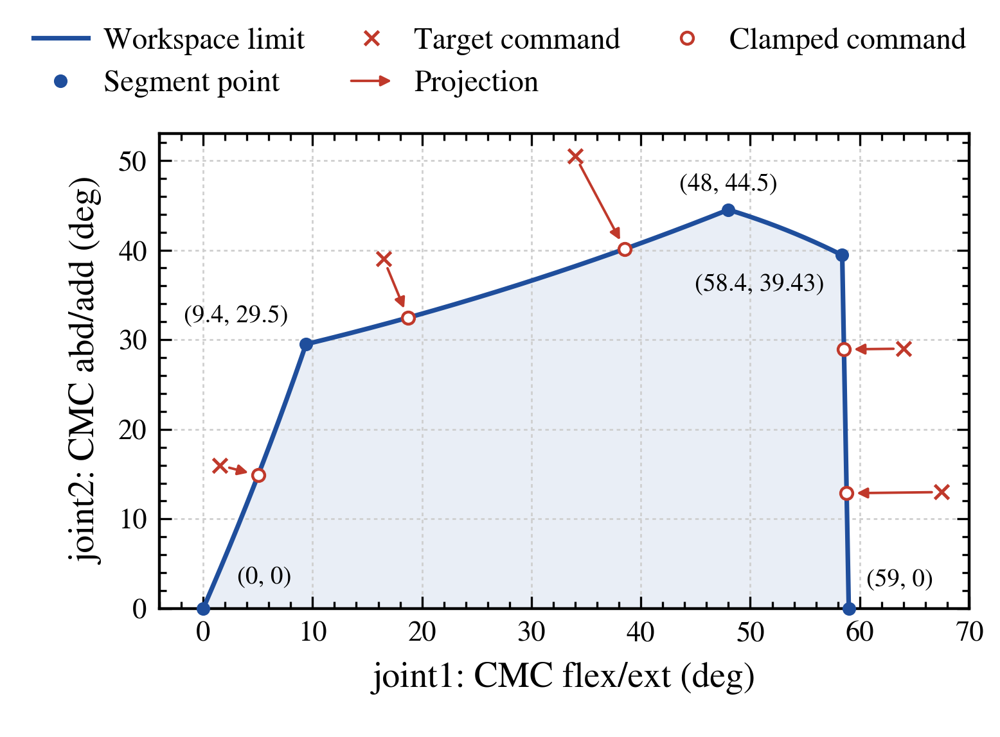
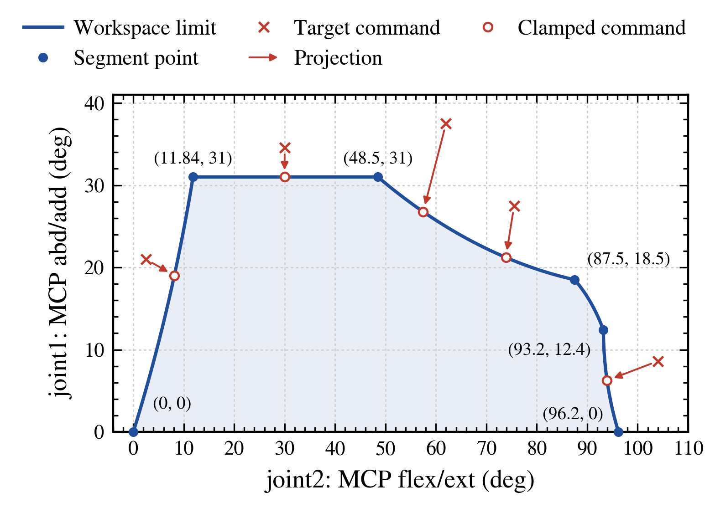
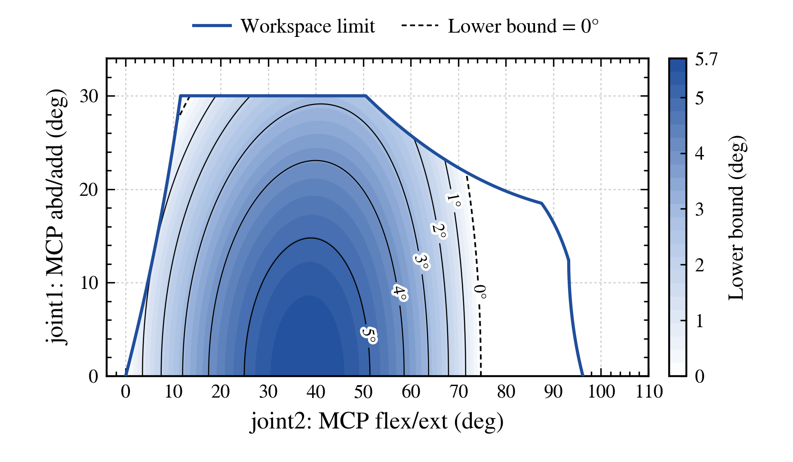

# Workspace limits

joint 공간 명령([`JointPositionCommand`](08_cpp_api_reference/types_command.md#jointpositioncommand), [`JointImpedanceCommand`](08_cpp_api_reference/types_command.md#jointimpedancecommand))은 IK 전에 각 finger의 도달 가능
workspace 안으로 투영됩니다. 범위 제한과 가장 가까운 자세로의 투영은 SDK가 자동으로 적용하므로,
명령을 보낼 때 따로 할 일은 없습니다. 아래에서 그 범위와 투영 방식을 다룹니다.

명령을 보내기 전에 같은 제한을 직접 계산하려면(예: 상위 제어기에서 목표를 미리 맞출 때) 이 문서의 식과
표로 구현하십시오.

> [!IMPORTANT]
> 이 문서의 범위와 식은 hand type A·B의 것입니다. type C로 빌드한 SDK는 0.7.0의 범위를 그대로 쓰고,
> long finger `joint3`의 하한이 없습니다. 그 범위는
> [0.7.0의 Workspace limits](https://github.com/aidinrobotics/aidin-hand2-sdk/blob/v0.7.0/docs/ko/14_workspace_limits.md)에 있습니다.

## Contents

&nbsp;&nbsp;[**1. Joint limits**](#1-joint-limits)<br>
&nbsp;&nbsp;[**2. Thumb**](#2-thumb)<br>
&nbsp;&nbsp;&nbsp;&nbsp;&nbsp;&nbsp;[2.1 joint0](#21-joint0)<br>
&nbsp;&nbsp;&nbsp;&nbsp;&nbsp;&nbsp;[2.2 joint1 and joint2](#22-joint1-and-joint2)<br>
&nbsp;&nbsp;&nbsp;&nbsp;&nbsp;&nbsp;[2.3 joint3](#23-joint3)<br>
&nbsp;&nbsp;[**3. Long finger**](#3-long-finger)<br>
&nbsp;&nbsp;&nbsp;&nbsp;&nbsp;&nbsp;[3.1 joint1 and joint2](#31-joint1-and-joint2)<br>
&nbsp;&nbsp;&nbsp;&nbsp;&nbsp;&nbsp;[3.2 joint3](#32-joint3)

## 1. Joint limits

finger별 각 joint의 허용 범위입니다.

long finger(index / middle / ring / baby)입니다.

| Joint | Axis | Allowed range |
| :--- | :--- | :--- |
| `joint1` | MCP abduction/adduction | [−30.0°, 30.0°] (coupled) |
| `joint2` | MCP flexion/extension | [0°, 96.2°] (coupled) |
| `joint3` | PIP flexion/extension | [0°, 80°] (하한은 `joint1`·`joint2`에 따라) |
| `joint4` | DIP flexion/extension | [0°, 90.6°] (passive) |

thumb입니다. CMC(손목손허리관절)가 3축이라 `joint0`·`joint1`·`joint2`가 각각 다른 축을 맡고, long
finger와 달리 `joint1`이 flexion, `joint2`가 abduction입니다.

| Joint | Axis | Allowed range |
| :--- | :--- | :--- |
| `joint0` | CMC rotation | [0°, 108.8°] |
| `joint1` | CMC flexion/extension | [0°, 59°] (coupled) |
| `joint2` | CMC abduction/adduction | [−44.5°, 44.5°] (coupled) |
| `joint3` | MCP flexion/extension | [0°, 75°] |
| `joint4` | IP flexion/extension | [0°, 84.8°] (passive) |

표의 괄호는 다음을 뜻합니다.

- **(coupled)**: 두 joint(abduction, flexion)가 하나의 workspace를 공유합니다. 표의 값은 그 쌍의 최대
  도달값이고, 실제로 허용되는 최대값은 상대 joint의 각도에 따라 작아집니다. 경계는
  [2.2 joint1 and joint2](#22-joint1-and-joint2)와
  [3.1 joint1 and joint2](#31-joint1-and-joint2)에 있습니다.
- **(하한은 `joint1`·`joint2`에 따라)**: long finger `joint3`의 하한은 `joint1`·`joint2`에 따라 0°에서
  5.7° 사이로 바뀝니다. 상한 80°는 자세와 무관합니다. 식은 [3.2 joint3](#32-joint3)에 있습니다.
- **(passive)**: joint 명령의 `target`(16개)에는 `joint4` 자리가 없어서 명령으로 지정할 수 없고,
  각도는 `joint3`에 종속됩니다. 현재 각도는 [`JointState`](08_cpp_api_reference/types_state.md#jointstate)의
  `position_rad`로 읽습니다. 표의 범위는 `joint3`이 0°일 때와 상한(long finger 80°, thumb 75°)일 때의
  `joint4` 각도입니다.

괄호가 없는 thumb의 `joint0`·`joint3`은 다른 joint와 무관하게 표의 범위를 그대로 씁니다.

## 2. Thumb

### 2.1 joint0

`joint0`(CMC rotation)의 범위는 [0°, 108.8°]이고, 다른 joint와 무관합니다. 범위 밖의 명령은
이 범위 안으로 제한합니다.

### 2.2 joint1 and joint2

`joint1`(CMC flexion/extension) 각도를 $x$, `joint2`(CMC abduction/adduction) 각도를
$y$로 표기합니다. 두 joint는 하나의 workspace를 공유합니다. $x$의 범위는 [0°, 59°]이고, $y$의 범위는
$[-y_{\max}(x),\ y_{\max}(x)]$입니다. 경계는 $y$의 부호에 대해 대칭이므로, 그림에는 $y$가 0 이상인
쪽만 그렸습니다.



$y_{\max}$는 여러 개의 segment로 구성되며, 각 segment는 두 점

```math
\mathbf p_0 = (x_0,\ y_0), \qquad \mathbf p_1 = (x_1,\ y_1)
```

사이에서 정의되는 line 또는 arc입니다. 따라서 각 segment의 유효 범위는 $x \in [x_0,\ x_1]$입니다.

line segment는 두 점 사이의 선형 보간이고, arc segment는 원의 중심 $\mathbf c = (x_c,\ y_c)$와
signed radius $R$로 정의됩니다.

```math
y_{\max}(x) =
\begin{cases}
y_0 + \dfrac{x - x_0}{x_1 - x_0}\,(y_1 - y_0) & \text{Line} \\[2ex]
y_c + R\sqrt{1 - \left(\dfrac{x - x_c}{R}\right)^2} & \text{Arc}
\end{cases}
```

$\mathbf c$는 두 점과 $R$로 정해지는 값이고, 아래 표에는 소수 넷째 자리까지 적었습니다.

thumb의 $y_{\max}$는 다음 4개 segment로 구성됩니다.

| Type | $\mathbf p_0$ | $\mathbf p_1$ | $\mathbf c$ | $R$ |
| :--- | ---: | ---: | ---: | ---: |
| Arc | (0, 0) | (9.4, 29.5) | (−423.8055, 151.2907) | −450 |
| Arc | (9.4, 29.5) | (48, 44.5) | (−61.5422, 269.2232) | −250 |
| Arc | (48, 44.5) | (58.4, 39.43) | (27.0304, −11.7163) | 60 |
| Line | (58.4, 39.43) | (59, 0) | — | — |

음수 $x$는 0°로 제한합니다. $(x, |y|)$가 workspace 안이면 명령을 그대로 둡니다. 밖이면 유클리드
거리로 가장 가까운 경계 위의 점으로 옮기고(그림의 빨간 화살표), $y$의 부호를 되돌립니다. 이때 $x$와
$y$가 함께 바뀔 수 있습니다.

### 2.3 joint3

`joint3`(MCP flexion/extension)의 범위는 [0°, 75°]이고, 다른 joint와 무관합니다. 범위 밖의
명령은 이 범위 안으로 제한합니다.

## 3. Long finger

### 3.1 joint1 and joint2

`joint2`(MCP flexion/extension) 각도를 $x$, `joint1`(MCP abduction/adduction) 각도를 $y$로
표기합니다. 두 joint는 하나의 workspace를 공유합니다. $x$의 범위는 [0°, 96.2°]이고, $y$의 범위는
$[-y_{\max}(x),\ y_{\max}(x)]$입니다. 경계는 $y$의 부호에 대해 대칭이므로, 그림에는 $y$가 0 이상인
쪽만 그렸습니다.



$y_{\max}$는 여러 개의 segment로 구성되며, 각 segment는 두 점

```math
\mathbf p_0 = (x_0,\ y_0), \qquad \mathbf p_1 = (x_1,\ y_1)
```

사이에서 정의되는 line 또는 arc입니다. 따라서 각 segment의 유효 범위는 $x \in [x_0,\ x_1]$입니다.

line segment는 두 점 사이의 선형 보간이고, arc segment는 원의 중심 $\mathbf c = (x_c,\ y_c)$와
signed radius $R$로 정의됩니다.

```math
y_{\max}(x) =
\begin{cases}
y_0 + \dfrac{x - x_0}{x_1 - x_0}\,(y_1 - y_0) & \text{Line} \\[2ex]
y_c + R\sqrt{1 - \left(\dfrac{x - x_c}{R}\right)^2} & \text{Arc}
\end{cases}
```

$\mathbf c$는 두 점과 $R$로 정해지는 값이고, 아래 표에는 소수 넷째 자리까지 적었습니다.

long finger의 $y_{\max}$는 다음 5개 segment로 구성됩니다.

| Type | $\mathbf p_0$ | $\mathbf p_1$ | $\mathbf c$ | $R$ |
| :--- | ---: | ---: | ---: | ---: |
| Arc | (0, 0) | (11.56, 30) | (−142.7639, 72.2389) | −160 |
| Line | (11.56, 30) | (50.5, 30) | — | — |
| Arc | (50.5, 30) | (87.5, 18.5) | (104.1494, 137.3394) | −120 |
| Arc | (87.5, 18.5) | (93.2, 12.4) | (76.0587, 2.0958) | 20 |
| Arc | (93.2, 12.4) | (96.2, 0) | (121.1992, 12.6111) | −28 |

음수 $x$는 0°로 제한합니다. $(x, |y|)$가 workspace 안이면 명령을 그대로 둡니다. 밖이면 유클리드
거리로 가장 가까운 경계 위의 점으로 옮기고(그림의 빨간 화살표), $y$의 부호를 되돌립니다. 이때 $x$와
$y$가 함께 바뀔 수 있습니다.

### 3.2 joint3

`joint3`(PIP flexion/extension) 각도를 $z$로 표기합니다. `joint3`의 범위는 $[z_{\min}(x, y),\ 80°]$입니다. 상한
80°는 자세와 무관하고, 하한 $z_{\min}$은 3.1절의 $x$, $y$의 함수입니다. 범위 밖의 명령은
이 범위 안으로 제한하며, $z_{\min}$은 $(x, y)$를 3.1절의 경계로 투영한 뒤의 값으로 정합니다.

아래 식에서 각도는 모두 rad입니다.

```math
z_{\min}(x, y) = \max\bigl(0,\ \varphi(x, y)\bigr)
```

$\varphi(x, y)$는 다음과 같이 정의됩니다.

```math
\begin{aligned}
\beta &= a_0 - x \\[1ex]
\lambda &= a_1 + x + \mathrm{atan2}\bigl(\sin\beta + a_2\cos y,\ \cos\beta + a_3\bigr)
  - \arccos\frac{a_4 + a_5\sin\beta\cos y + a_6\cos\beta}
               {\sqrt{a_7 + a_8\cos^2 y + a_9\sin\beta\cos y + a_{10}\cos\beta}} \\[1ex]
\varphi &= b_0 - \mathrm{atan2}\bigl(\sin\lambda + b_1,\ \cos\lambda + b_2\bigr)
  + \arccos\frac{b_3 + b_4\cos\lambda + b_5\sin\lambda}
               {\sqrt{b_6 + b_7\cos\lambda + b_8\sin\lambda}}
\end{aligned}
```

상수는 다음과 같습니다.

| $i$ | $a_i$ | $b_i$ |
| ---: | ---: | ---: |
| 0 | 0.819728 | −3.26693 |
| 1 | 1.79827 | −2.91243 |
| 2 | 0.287368 | −1.56229 |
| 3 | 0.142105 | −2.13874 |
| 4 | 0.371072 | 2.10835 |
| 5 | 0.34125 | 3.93041 |
| 6 | 0.16875 | 11.923 |
| 7 | 1.02019 | −3.12458 |
| 8 | 0.0825804 | −5.82487 |
| 9 | 0.574736 | — |
| 10 | 0.28421 | — |

workspace 안에서 $z_{\min}$은 0~0.0995 rad(0°~5.7°)입니다. $y$가 0이면 $x$가 1.3044 rad(74.7°)
이상에서 $\varphi \le 0$이 되어 하한이 0입니다.


